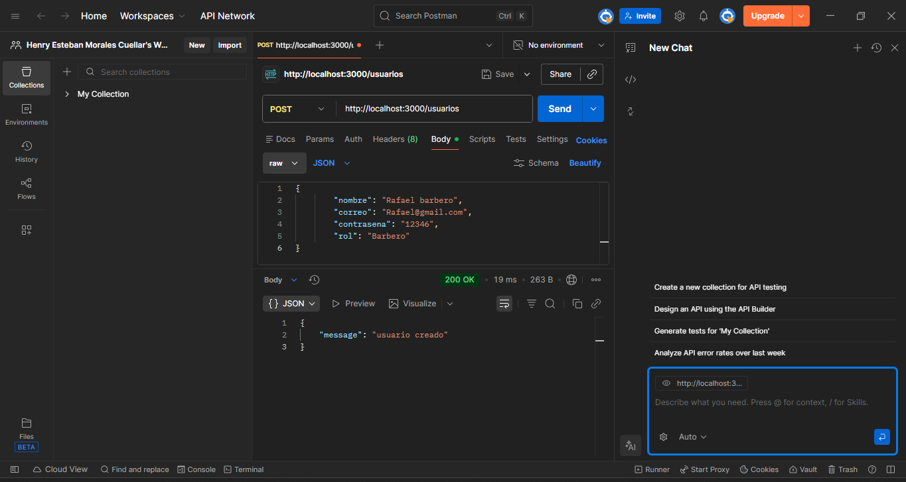
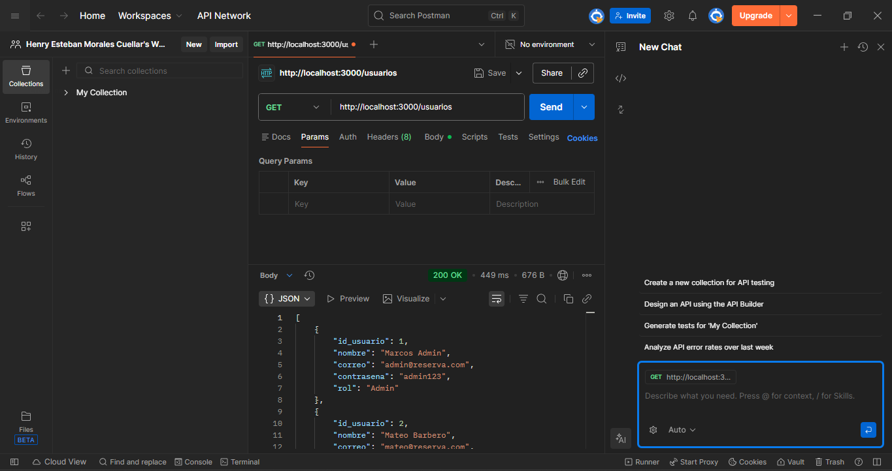
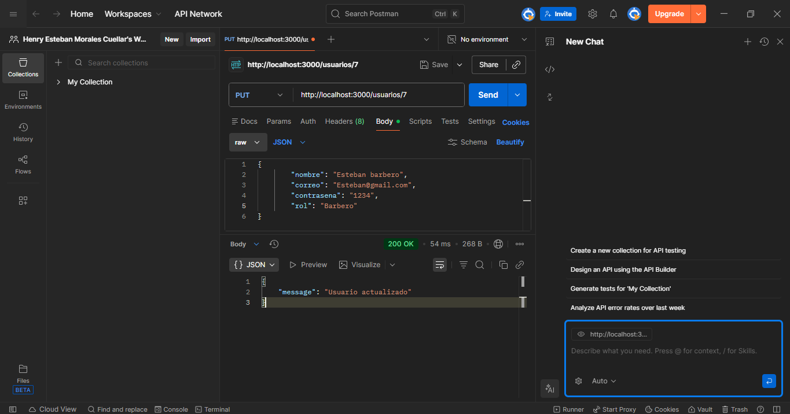
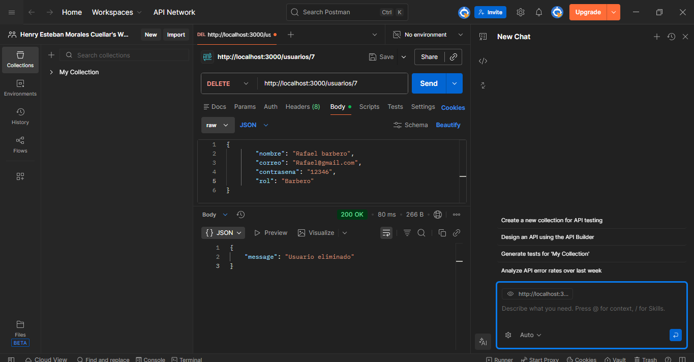

# Mi Proyecto reserva tu estilo 💈

## Evidencia: Codificación de Módulos del Software - Reserva Tu Estilo
**ID de Evidencia:** GA7-220501096-AA5-EV01

## 📋 Descripción
Este módulo realiza la gestión de usuarios (CRUD) y la implementación de servicios de autenticación segura para el proyecto "Reserva Tu Estilo", utilizando Node.js, MySQL y React.

## 🛠️ Tecnologías Utilizadas
* **Backend:** Node.js / Express
* **Base de Datos:** MySQL
* **Seguridad:** JSON Web Token (JWT) y Bcryptjs
* **Frontend:** React.js
* **Versionamiento:** Git / GitHub

---

## 🚀 Pruebas de Funcionamiento (CRUD en Postman)

### 1. Inserción (Create)
Permite registrar nuevos usuarios en la base de datos.

### 2. Consulta (Read)
Muestra la lista de usuarios registrados.

### 3. Actualización (Update)
Modifica la información de un usuario existente mediante su ID.

### 4. Eliminación (Delete)
Elimina un registro de la base de datos.

---

## 💻 Evidencia AA5: Diseño y Desarrollo de Servicios Web

### 📸 Interfaz de Usuario (React)
Interfaz de registro operando en tiempo real y conectada al backend:

### 1. Registro con Encriptación (Bcrypt)
Servicio que recibe los datos y cifra la contraseña antes de almacenarla en MySQL.

### 2. Inicio de Sesión y Token (JWT)
Servicio de autenticación que valida credenciales y genera un token de seguridad.

### 3. Validaciones de Verificación
Pruebas de manejo de errores cuando los datos son incorrectos o el usuario no existe.

---

## ⚙️ Configuración del Proyecto
Para ejecutar este proyecto localmente:
1. Configurar archivo `.env` con las credenciales de la DB y `JWT_SECRET`.
2. Ejecutar `npm install` en las carpetas de backend y frontend.
3. Iniciar con `npm start`.

**Aprendiz:** Henry Esteban Morales Cuellar
**Programa:** ADSO