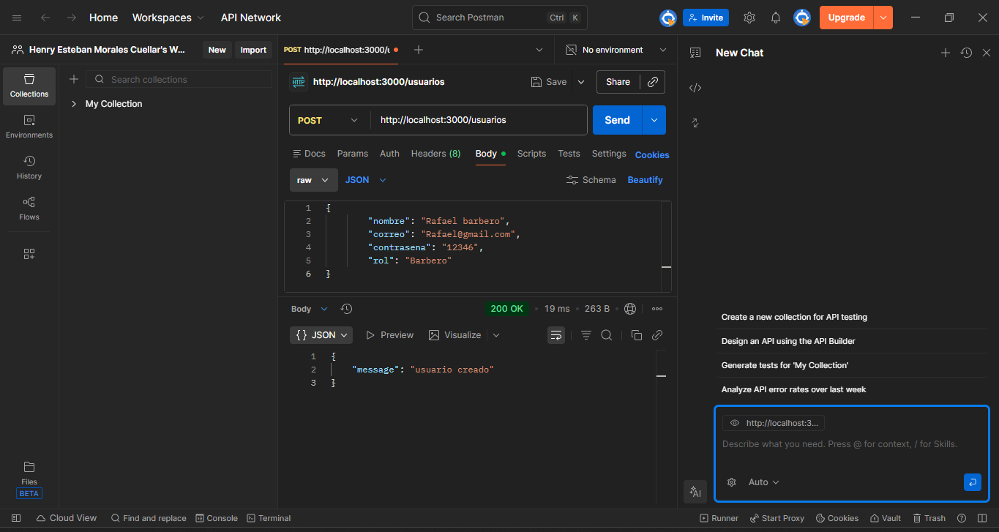
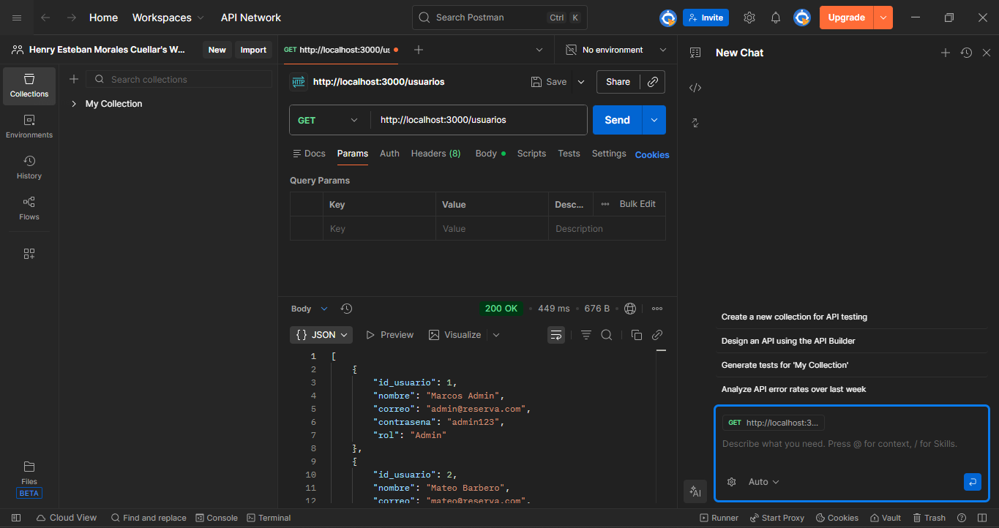
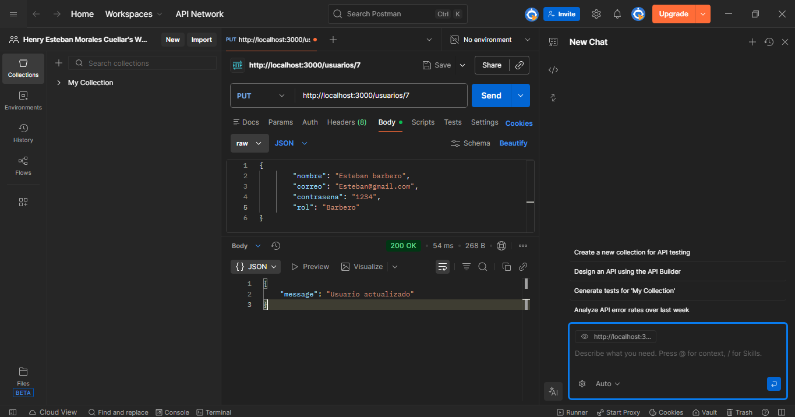
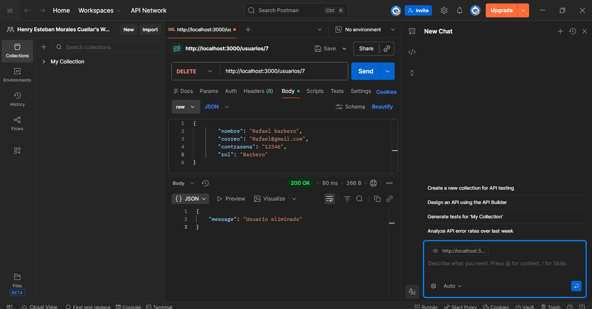

# Evidencia: Codificación de Módulos del Software - Reserva Tu Estilo
**ID de Evidencia:** GA7-220501096-AA2-EV01

## 📋 Descripción
Este módulo realiza la gestión de usuarios (CRUD) para el proyecto "Reserva Tu Estilo", utilizando Node.js y MySQL. Se ha implementado siguiendo una arquitectura modular (MVC) para cumplir con los estándares de codificación solicitados.

## 🛠️ Tecnologías Utilizadas
* **Entorno:** Node.js
* **Framework:** Express
* **Base de Datos:** MySQL
* **Versionamiento:** Git / GitHub

## 🚀 Pruebas de Funcionamiento (CRUD en Postman)

### 1. Inserción (Create)
Permite registrar nuevos usuarios en la base de datos.

### 2. Consulta (Read)
Muestra la lista de usuarios registrados.

### 3. Actualización (Update)
Modifica la información de un usuario existente mediante su ID.

### 4. Eliminación (Delete)
Elimina un registro de la base de datos.

---
**Aprendiz:** Henry Esteban Morales Cuellar
**Programa:** ADSO